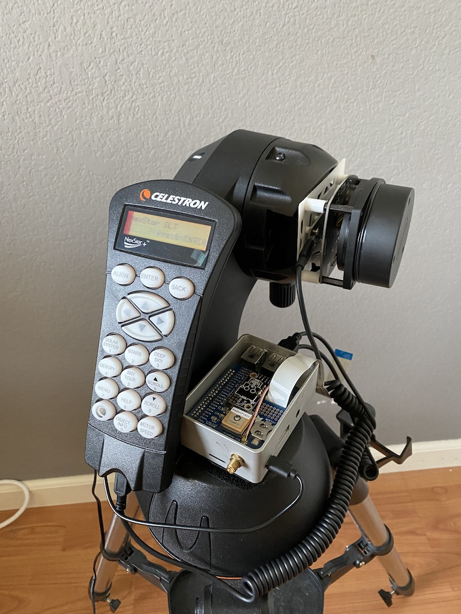

# OpenLiDAR

Open platform for automating LiDAR scanns with DIY devices. 

The hardware setup basically consist on an affordable 360 LiDAR sensor attached to a mount that spins it around in a control way. The `OpenLiDAR.h` class reflect this configuration, although for my personal setup I'm using a [RPLiDAR A1](https://www.dfrobot.com/search-RPLIDAR.html) together with a [Motorize Celestron Telescope Mount](https://www.ebay.com/sch/i.html?_from=R40&_trksid=p2334524.m570.l1313.TR4.TRC0.A0.H0.Xcelestron+mount.TRS1&_nkw=celestron+mount&_sacat=0&LH_TitleDesc=0&_osacat=0&_odkw=celestron+goto) I'm designing the library to be easy to extend and modularize with the hope others will contribute their own configurations.

## My setup

Because hardware is not really one of my strengths I decide to reuse existing hardware as much as possible. Avoiding 3D printing moving peaces like gears was very important because they tend to introduce error. For that I based my desing on using a motorize telescope mount which robust design have been tested extensivelly while provides maximum presicion and control. As an extra if it's properly calibrated (using their own system based on stars possition) can waranty excelent alignments of your point clouds.

* [RPLiDAR A1/A2/A3](https://www.dfrobot.com/search-RPLIDAR.html) depending your needs and budge (from 99 ~ 600 U$D)
* [Celestron NexStar GoTo Mount](https://www.ebay.com/itm/Celestron-Astro-Fi-Computerized-GoTo-Mount-Complete-Mount-NEW/402029171407?_trkparms=aid%3D111001%26algo%3DREC.SEED%26ao%3D1%26asc%3D20160811114145%26meid%3Dac0b70c81d164dd9bf6b6775530718f0%26pid%3D100667%26rk%3D2%26rkt%3D8%26mehot%3Dnone%26sd%3D303235523326%26itm%3D402029171407%26pmt%3D0%26noa%3D1%26pg%3D2334524&_trksid=p2334524.c100667.m2042) to spin the RPLiDAR around in 360 degrees with precision (~200 U$D). The `Celestron.h` driver sends [serial commands to the Celestron HandController](http://www.nexstarsite.com/download/manuals/NexStarCommunicationProtocolV1.2.zip) though the Mini-USB port at the bottom of it. Most of that code is based on [INDI Lib](https://github.com/jochym/indi-base/blob/master/libindi/obsolete/celestronprotocol.h).
* [Celestron compatible dovetail mount](https://www.amazon.com/gp/product/B07LGN4K6L/ref=ppx_yo_dt_b_asin_title_o02_s00?ie=UTF8&psc=1). Non-permanent solution to attach the LiDAR sensor to the Celestron mount.
* 3D Print the model on the `models/` folder based on [this thingiverse project](https://www.thingiverse.com/thing:3970110) by [Robotics Weekends](https://www.thingiverse.com/Robotics_Weekends/about). This will help you to put it all together.



Optional:

* [RaspberryPi](https://www.raspberrypi.org/products/raspberry-pi-4-model-b/) to control both the sensor and the mount running OpenLiDAR. I [modify my Celestron mount following this directions in order to derive power from it](https://hackaday.io/project/21088-raspberry-pi-driven-telescope-mount) (35 U$D)
* [GPS Hat](https://www.adafruit.com/product/2324) If you want to GeoTag your point clouds (45 U$D)


# Installation

Install dependencies:

```bash
sudo apt install cmake libpcl-dev libglm-dev
```

Clone this repository:

```bash
git clone https://github.com/patriciogonzalezvivo/OpenLiDAR.git
```

Compile and Install

```bash
cd OpenLiDAR
mkdir build
cd build
cmake ..
make
```

Give your user permission to access the USB ports:

```bash
sudo usermod -a -G dialout $USER
```

## Apps

Ecosystem of apps to scann and process LiDAR data.

### Scan

Makes a 360 scan. To run you need to the USB addresses of the Celestron mount (first argument) and the RPLiDAR sensor (second argument). In linux systems they are given by the order you plug them. (TODO: I'm working on automatic that)

```bash
./scan /dev/ttyUSB0 /dev/ttyUSB1
```